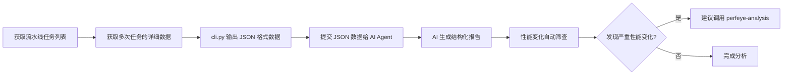

# 性能对比分析指南

性能对比分析指南 - 使用 AI Agent 对比流水线多次执行的性能数据，识别性能回归和优化效果。

---

## 目录

- [工作流程](#工作流程)
- [数据获取](#数据获取)
- [AI Agent 分析](#ai-agent-分析)
- [性能变化筛查](#性能变化筛查)
- [报告模板](#报告模板)
- [完整示例](#完整示例)

---

## 工作流程



**核心思想**：
1. 数据获取：使用 CLI 工具获取 JSON 格式的性能数据
2. AI 分析：让 AI Agent 分析 JSON 数据，识别趋势和问题
3. 结构化输出：按照模板生成专业的性能对比报告
4. 自动筛查：自动识别性能变化较大的用例和设备
5. 智能建议：根据分析结果询问是否需要深入分析

**任务和用例状态定义**: 见 [SHARED.md](./SHARED.md#任务和用例状态定义)
**数据获取规则**: 见 [SHARED.md](./SHARED.md#数据获取规则)

---

## 数据获取

### Step 0: Task Discovery (推荐)

在获取性能数据之前，先使用发现工作流找到目标任务：

```bash
# 发现任务
python scripts/cli.py tasks --build-name "TDR" --start-time "2026-02-01" --end-time "2026-02-14" --discover
```

系统将返回精简的任务列表，帮助您选择要对比的任务。

### 获取流水线任务列表

```bash
# 方式1：按任务名称查询（默认最近1个月）
python scripts/cli.py tasks --build-name "TDR" --count <次数>

# 方式2：按流水线 ID 查询
python scripts/cli.py tasks --pipeline-id <流水线ID> --count <次数>

# 方式3：按名称+时间范围查询
python scripts/cli.py tasks --build-name "TDR" --start-time "2026-02-01" --count <次数>

# 示例：获取 TDR 任务最近 2 次执行（基础性能对比）
python scripts/cli.py tasks --build-name "TDR" --count 2

# 示例：获取 TDR 任务最近 5 次执行（深度性能对比）
python scripts/cli.py tasks --build-name "TDR" --count 5

# 示例：按流水线 ID 获取最近 2 次任务（原有方式）
python scripts/cli.py tasks --pipeline-id 932 --count 2
```

### 获取单个任务详情

```bash
# 获取单个任务的完整执行情况和性能数据
python scripts/cli.py builds --id <BuildID> --device-executions

# 示例
python scripts/cli.py builds --id 128539 --device-executions
```

### 保存到文件

```bash
# 方式1：按任务名称保存（推荐）
python scripts/cli.py tasks --build-name "TDR" --count 2 --output-file performance_data.json

# 方式2：按流水线 ID 保存
python scripts/cli.py tasks --pipeline-id 932 --count 2 --output-file performance_data.json

# 保存单个任务的详情
python scripts/cli.py builds --id 128539 --device-executions --output-file task_128539.json
```

**输出格式**: 所有输出都是 JSON 格式，专为 AI Agent 分析设计。

---

## AI Agent 分析

### Prompt 模板

```
你是一个性能测试分析专家。请分析以下自动化测试平台的性能对比数据（JSON 格式），生成结构化的性能对比报告。

## 分析任务

1. **数据概览**：总结分析的 Build 数量、用例数量、设备数量
2. **性能趋势分析**：对比多次执行，识别性能指标的变化趋势
3. **回归检测**：检测是否存在性能回归（FPS 下降、JANK 增加、内存增长）
4. **异常识别**：识别异常的性能数据点（极端值、突变等）
5. **达标分析**：判断性能是否达到基准线
6. **性能变化筛查**：筛查出性能变化较大的用例和设备（FPS 变化 > 10% 或 JANK 变化 > 50%）
7. **优化建议**：基于分析结果提供优化建议

## 性能基准

- 平台：PC
- 目标 FPS：≥ 60
- 目标 JANK：< 10 次/10min

## 性能数据

{将 cli.py 输出的 JSON 数据粘贴在这里}
```

**性能指标说明**: 见 [SHARED.md](./SHARED.md#性能指标说明)

---

## 性能变化筛查

### 筛查标准

| 变化类型 | 严重程度 | 判断标准 |
|---------|---------|----------|
| **FPS 下降** | 🔴 严重 | FPS 下降百分比 > 10% |
| **FPS 下降** | 🟡 需关注 | FPS 下降百分比在 5%-10% 之间 |
| **JANK 增加** | 🔴 严重 | JANK 增加百分比 > 100% 且最新值 >= 20 |
| **JANK 增加** | 🟡 需关注 | JANK 增加百分比在 50%-100% 之间 且最新值 >= 20 |
| **FPS/JANK/内存** | 🟢 正常 | 不满足以上"严重"或"需关注"条件的所有情况 |

**⚠️ 重要：必须严格执行标准，禁止放宽条件！**

- 🔴 严重：仅当 FPS 下降 > 10% **或者** (JANK 增加 > 100% 且最新值 >= 20)
- 🟡 需关注：仅当 (FPS 下降 5%-10%) **或者** (JANK 增加 50%-100% 且最新值 >= 20)
- 🟢 正常：其他所有情况

### 筛查输出

AI Agent 会在报告中自动生成以下内容：

#### 性能变化筛查章节

包含两个表格：
1. **重点用例（性能变化较大）**：列出所有需要关注的用例-设备组合
2. **设备性能变化汇总**：统计各设备的问题数量

#### 进一步分析建议章节（如果发现严重问题）

如果发现严重性能问题，会包含：
1. **调用说明**：何时需要调用 perfeye-analysis
2. **获取 UUID**：如何获取 Perfeye UUID
3. **调用示例**：具体的调用格式

---

## 报告模板

```markdown
# 性能对比分析报告

**生成时间**: 2026-01-31 23:40
**分析人员**: AI Agent
**流水线**: TDR 日常监控 release（PC）（主干）

---

## 📊 分析概览

| 项目 | 信息 |
|------|------|
| **对比版本** | 1月30日 vs 1月31日 |
| **用例数量** | X 个 |
| **设备数量** | X 台 |

---

## 📈 性能趋势分析（按用例分析）

### 总体趋势

| 指标 | 趋势 |
|------|------|
| **平均 FPS** | 🔻 73.62 → 64.42 (-12.5%) |
| **平均 JANK** | 🔺 13.63 → 28.80 (+111.4%) |
| **平均内存** | ✅ 8841.49 → 7803.59 MB (-11.7%) |

### 用例级别性能趋势

| 用例名称 | 平均 FPS | FPS 变化 | 平均 JANK | JANK 变化 | 平均内存(MB) | 内存变化 | 趋势评估 |
|----------|----------|----------|-----------|-----------|--------------|----------|----------|
| 主城跑图(TDR) | 🔻 57.87 | -7.8% | 🔺 54.97 | +135.4% | ✅ 8288.45 | -12.1% | ⚠️ |

**趋势评估**：✅ 改善 | ⚠️ 需关注 | ➡️ 稳定 | ❌ 失败

---

## 🖥️ 设备配置

| 设备名称 | 配置 | 状态 |

---

## 📋 用例性能对比

### 用例名称

| 设备名称 | FPS | JANK | 内存(MB) |
|----------|-----|------|---------|
| **i7-8700k RTX2060** | 🔻 52.21 → 48.90 (-6.3%) | ✅ 5.78 → 3.85 (-33.4%) | ✅ 9774 → 8662 (-11.4%) |

**分析**：简要总结该用例的性能表现

---

## 🔬 性能变化筛查

### 🎯 重点用例（性能变化较大）

| 用例名称 | 问题设备 | 性能指标 | 变化情况 | 严重程度 |
|----------|---------|----------|----------|----------|

**筛查标准**（必须严格执行）：
- 🔴 **严重**：FPS 下降 > 10% 或 (JANK 增加 > 100% 且最新值 >= 20)
- 🟡 **需关注**：FPS 下降 5%-10% 或 (JANK 增加 50%-100% 且最新值 >= 20)
- 🟢 **正常**：其他所有情况（不满足上述"严重"或"需关注"条件）

### 📊 设备性能变化汇总

| 设备名称 | 问题用例数量 | 严重问题 | 需关注 | 状态 |

**说明**：此部分自动筛查出需要重点关注的性能变化，帮助快速定位问题。

---

## 🔍 问题分析

### ❌ 严重问题

（列出需立即处理的问题）

### ⚠️ 需关注

（列出需要关注的问题）

### ✅ 积极变化

（列出改善的指标）

---

## 📊 设备性能排名

### FPS 排名

| 排名 | 设备名称 | 配置 | 平均 FPS |

### JANK 排名

| 排名 | 设备名称 | 配置 | 平均 JANK |

---

## 💡 优化建议

### 🔴 立即处理

（高优先级问题）

### 🟡 本周完成

（中优先级问题）
```

---

## 完整示例

### 场景 1：基础性能对比（对比最近 2 次执行）

```bash
cd /path/to/auto-platform-query

# 方式1：按任务名称查询（推荐）
python scripts/cli.py tasks --build-name "TDR" --count 2

# 方式2：按流水线 ID 查询
python scripts/cli.py tasks --pipeline-id 932 --count 2
```

AI Agent 会生成基础性能对比报告，重点关注：
- 📊 FPS、JANK、内存峰值 三项指标的对比
- ⚠️ 性能回归检测（2 次执行之间的变化）
- ✅ 达标分析（基于 PC ≥ 60 FPS、JANK < 10 标准）

### 场景 2：深度性能对比（对比最近 3-5 次执行）

```bash
cd /path/to/auto-platform-query

# 方式1：按任务名称查询（推荐）
python scripts/cli.py tasks --build-name "TDR" --count 3

# 方式2：按名称+时间范围查询
python scripts/cli.py tasks --build-name "TDR" --start-time "2026-02-01" --count 5

# 方式3：按流水线 ID 查询
python scripts/cli.py tasks --pipeline-id 932 --count 5
```

AI Agent 会生成完整的性能对比分析报告。

---

## 进一步分析建议

### 💡 是否需要深入分析？

根据上述性能对比结果，如果发现以下情况，建议进一步调用 **perfeye-analysis** skill 进行深入分析：

- 发现严重的性能回归（FPS 下降 > 15% 或 JANK 增加 > 100%）
- 多个设备在同一用例下性能异常
- 需要分析 CPU/GPU/内存的瓶颈原因

### 如何调用 perfeye-analysis skill

**重要**：perfeye-analysis skill 需要 **具体用例 + 具体设备** 的多份 Perfeye UUID 进行对比分析。

#### 1. 获取 Perfeye UUID

```bash
# 获取任务详情
python scripts/cli.py builds --id <BuildID> --device-executions
```

从返回的 JSON 数据中，找到对应用例和设备的 **Perfeye UUID**（位于 `reportData.perfeye` 字段）。

#### 2. 调用示例

```
使用 perfeye-analysis skill 对以下数据进行性能对比分析：

用例信息：
- 用例名称：主城跑图(TDR)（雨天）
- 设备名称：i3-2120 GTX650
- 分析重点：JANK 异常高的根本原因

Perfeye 数据：
数据1（Build 128698）：abc123-def456-ghi789
数据2（Build 128948）：def456-ghi789-jkl012
```
