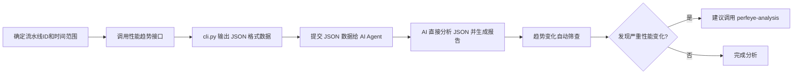

# 性能趋势分析指南

使用流水线性能趋势接口分析指定时间段内的性能变化，识别性能回归和趋势变化。

---

## 目录

- [工作流程](#工作流程)
- [数据获取](#数据获取)
- [AI Agent 分析](#ai-agent-分析)
- [趋势变化筛查](#趋势变化筛查)
- [报告模板](#报告模板)

---

## 工作流程



**核心原则**：
1. **CLI 只负责获取数据**：从平台获取 JSON 数据
2. **AI 负责所有分析**：不写脚本，直接让 AI 分析原始 JSON

**任务和用例状态定义**: 见 [SHARED.md](./SHARED.md#任务和用例状态定义)

---

## 数据获取

### Step 0: Task Discovery (推荐)

```bash
# 发现流水线
python scripts/cli.py tasks --build-name "TDR" --start-time "2026-02-01" --end-time "2026-02-14" --discover
```

### 获取性能趋势数据

```bash
# 获取流水线最近 N 天的性能趋势（默认 3 天）
python scripts/cli.py pipeline --id <流水线ID> --trend-days

# 示例：获取 TDR 流水线最近 3 天的性能趋势
python scripts/cli.py pipeline --id 947 --trend-days 3

# 示例：获取特定时间段的性能趋势
python scripts/cli.py pipeline --id 947 --trend "2026-02-10" "2026-02-12"
```

**输出格式**: JSON 格式，专为 AI Agent 分析设计。

---

## 数据格式说明

```json
{
  "type": "performance_trend",
  "metadata": {
    "pipeline_id": 947,
    "pipeline_name": "TDR 日常监控 release（PC）（分支）",
    "date_range": {
      "start": "2026-02-10",
      "end": "2026-02-12",
      "days": 3
    }
  },
  "summary": {
    "data_points": 174,
    "unique_cases": 10,
    "unique_devices": 8
  },
  "performance_benchmarks": {
    "fps": {"target": 60, "unit": "FPS"},
    "jank": {"target": 10, "unit": "次/10min"}
  },
  "overall_trend": {
    "fps": {"fv": 68.85, "lv": 35.13, "ch": -33.72, "cp": -48.97},
    "jank": {"fv": 4.81, "lv": 108.41, "ch": 103.60, "cp": 2153.84}
  },
  "by_case": {
    "用例名称": {
      "ci": 12807,
      "n": 17,
      "f90": {"fv": 62.44, "lv": 56.46, "ch": -5.98, "cp": -9.58},
      "jk": {"fv": 7.37, "lv": 11.65, "ch": 4.28, "cp": 58.07},
      "mem": {"fv": 8395.00, "lv": 8638.53, "ch": 243.53, "cp": 2.90},
      "devs": {
        "di_1135": {
          "di": 1135,
          "dn": "15F_落英林_自动化_台式_i7-6700K - GTX1060(TDR)",
          "cfg": "中端配置",
          "f90": {"fv": 66.48, "lv": 67.08, "ch": 0.60, "cp": 0.90},
          "jk": {"fv": 4.15, "lv": 5.04, "ch": 0.89, "cp": 21.45},
          "mem": {"fv": 8645.16, "lv": 8722.55, "ch": 77.39, "cp": 0.89}
        }
      }
    }
  },
  "by_device": {
    "di_1135": {
      "di": 1135,
      "dn": "15F_落英林_自动化_台式_i7-6700K - GTX1060(TDR)",
      "cfg": "中端配置",
      "cn": [...],
      "n": 20,
      "f90": {"fv": 77.69, "lv": 72.35, "ch": -5.34, "cp": -6.87},
      "jk": {"fv": 7.18, "lv": 4.82, "ch": -2.36, "cp": -32.87}
    }
  },
  "overall_stats": {
    "fps_tp90": {"avg": 68.45, "min": 23.81, "max": 109.56},
    "jank_per_10min": {"avg": 15.28, "min": 0.0, "max": 199.41},
    "peak_memory_mb": {"avg": 7904.44, "min": 5595.1, "max": 10033.25}
  },
  "perfeye_uuids": {
    "用例名称": {
      "device_id_1135": "698d4a522e985f0551913ea7",
      "device_id_1164": "698d3ff52e985f055191348c"
    }
  }
}
```

**字段说明**：
- `fv`: 起始值 (First Value) - 时间轴起点的值（首次执行）
- `lv`: 最新值 (Latest Value) - 时间轴末端的值（最近一次执行）
- `ch`: 变化量 = lv - fv（正数=上升，负数=下降）
- `cp`: 变化百分比 = (lv - fv) / fv × 100
- `f90`: FPS TP90 - 第90百分位帧率
- `jk`: JANK - 每10分钟卡顿次数
- `mem`: 内存峰值 (MB)

---

## AI Agent 分析

### ⚠️ 重要原则

**CLI 输出的 JSON 是专门为 AI Agent 设计的，不要写任何脚本去处理这些数据！**

| ❌ 错误做法 | ✅ 正确做法 |
|-----------|-----------|
| 写 Python 脚本读取 JSON 并计算平均值 | 让 AI Agent 直接分析 JSON |
| 写脚本统计 FPS、JANK 的趋势 | AI Agent 自动识别趋势并生成报告 |
| 写脚本生成 CSV/Excel 报表 | AI Agent 直接生成 Markdown 报告 |
| 使用 pandas/numpy 进行数据分析 | AI Agent 利用其强大的分析能力直接理解数据 |

### ⚠️ 关键要求

**在分析性能趋势数据并生成报告时，必须遵循以下要求：**

1. **必须生成完整报告**：严格按照"报告模板"格式，包含所有章节
2. **禁止省略任何章节或改变表格结构**

### ⚠️ 报告格式要求（必须遵守）

**生成的报告必须严格按照下方「报告模板」章节的格式输出，包含以下所有章节：**

1. **标题部分**：生成时间、分析人员、流水线、分析时间范围
2. **📊 分析概览**：时间范围、数据点数量、用例数量、设备数量
3. **🖥️ 设备配置**：设备名称、配置、状态
4. **📋 用例性能对比**：每个用例的设备级对比表 + 分析说明
5. **🔬 性能变化筛查**：重点用例表格 + 设备性能汇总表格
6. **🔍 问题分析**：严重问题 + 需关注 + 积极趋势
7. **💡 优化建议**：立即处理

### Prompt 模板（代入 JSON 数据后提交给 AI Agent）

将下方的 "性能趋势数据" 部分替换为 cli.py 输出的完整 JSON，然后提交给 AI Agent 进行分析：

```
你是一个性能测试分析专家。请直接分析以下性能趋势 JSON 数据，生成结构化的性能趋势分析报告。

⚠️ 重要：
1. 不要写任何 Python 脚本来处理这个 JSON，直接基于原始 JSON 数据进行分析和统计
2. **报告必须按照下方「报告模板」格式输出，包含所有章节和表格结构，禁止省略任何内容**

## 分析任务

1. **数据概览**：总结分析的时间范围、数据点数量、用例数量、设备数量
2. **性能趋势分析**：按时间维度分析性能指标的变化趋势（上升/下降/波动）
3. **回归检测**：检测是否存在性能回归（FPS 下降、JANK 增加、内存增长）
4. **异常识别**：识别异常的性能数据点（极端值、突变等）
5. **达标分析**：判断性能是否达到基准线
6. **趋势变化筛查**：筛查出性能变化较大的用例和设备
7. **用例-设备维度分析（必须）**：为每个用例生成各设备的趋势变化对比表，FPS/JANK/内存峰值必须使用 `初始值 → 结束值 (变化百分比%)` 格式展示变化趋势，并添加分析说明
8. **优化建议**：基于趋势分析结果提供优化建议

## 数据格式说明

- 设备名称格式化：将 JSON 返回的设备名称中的 `|` 符号替换为 `-`，如 `15F_落英林_自动化_台式_i7-6700K | GTX1060(TDR)` 显示为 `15F_落英林_自动化_台式_i7-6700K - GTX1060(TDR)`
- 趋势变化格式：使用 `起始值 → 最新值 (变化百分比%)` 格式展示 FPS、JANK、内存峰值的变化趋势

**状态标识说明**：

- **FPS**: 🔻 下降（坏事）| ✅ 上升（好事）| ➡️ 变化 < 2%
- **JANK**: 🔺 上升（坏事）| ✅ 下降（好事）| ➡️ 变化 < 5%
- **内存**: 🔺 上升（坏事）| ✅ 下降（好事）| ➡️ 变化 < 5%
- **无对比数据**: ➡️ — → 值（表示第1次执行失败或无数据，第2次有数据）
- **完全失败**: ➡️ 值 → ❌（表示第2次执行失败）


**格式示例**：
- FPS：`🔺 89.44 → 114.73 (+28.2%)` → ✅ 性能改善
- JANK：`🔻 4.81 → 108.41 (+2153.8%)` → ❌ 性能下降

## 性能基准

- 目标 FPS：≥ 60
- 目标 JANK：< 15 次/10min

## 性能趋势数据

将 cli.py 输出的**完整 JSON 数据**粘贴到下方（替换 `{...}` 部分），然后提交给 AI Agent 进行分析：

```json
{将 cli.py 输出的完整 JSON 数据粘贴在这里}
```
```

---

## 趋势变化筛查

### 筛查标准

**注意**：根据箭头符号含义判断性能好坏
- FPS：✅ （数值上升）= ✅ 性能改善（绿色），🔻（数值下降）= ❌ 性能下降（红色）
- JANK：✅ （数值下降）= ✅ 性能改善（绿色），🔺（数值上升）= ❌ 性能下降（红色）
- 内存：✅ （数值下降）= ✅ 内存优化（绿色），🔺（数值上升）= ❌ 内存增长（红色）

| 变化类型 | 严重程度 | 判断标准 |
|---------|---------|----------|
| **FPS 下降**（🔻）| 🔴 严重 | FPS 下降百分比 > 10% |
| **JANK 增加**（🔺）| 🔴 严重 | JANK 增加百分比 > 100% 且 最新值 >= 20 |
| **JANK 增加**（🔺）| 🟡 需关注 | JANK 增加百分比在 50%-100% 之间 且 最新值 >= 20，**或者** JANK 最新值 >= 20 |
| **FPS/JANK/内存** | 🟢 正常 | 不满足以上"严重"或"需关注"条件的所有情况 |

**⚠️ 重要：必须严格执行标准，禁止放宽条件！**

- 🔴 严重：仅当 FPS 下降 > 10% **或者** (JANK 增加 > 100% 且最新值 >= 20)
- 🟡 需关注：仅当 (JANK 增加 50%-100% 且最新值 >= 20) **或者** JANK 最新值 >= 20
- 🟢 正常：其他所有情况

**示例**：
- JANK 8.72 → 14.83 (+70.07%)，最新值 14.83 < 20 → 🟢 正常（不满足最新值 >= 20）
- JANK 14.49 → 24.72 (+70.6%)，最新值 24.72 >= 20 → 🟡 需关注（满足两个条件）
- JANK 9.28 → 20.34 (+119.18%)，最新值 20.34 >= 20 → 🔴 严重（增加 > 100%）

### 筛查输出

AI Agent 会在报告中自动生成以下内容：

#### 趋势变化筛查章节

包含两个表格：
1. **重点用例（趋势异常）**：列出所有需要关注的用例
2. **设备趋势汇总**：统计各设备的异常数量

---

## 进一步分析指导

**说明**：本部分为 AI Agent 的内部指导，用于在需要时调用 perfeye-analysis skill 进行深入分析。

### 调用决策树

```
是否需要对性能问题进行深入分析？
├─ 否
│  └─ 完成分析，不调用 perfeye-analysis
│
└─ 是
   │
   └─ 用户是否明确指定分析单个案例？
      ├─ 是 → 执行单个 perfeye 分析
      │        使用指定案例的 UUID 进行单次性能分析
      │
      └─ 否（默认）→ 执行 perfeye 对比分析
                       └─ 从缓存文件中获取该设备对应案例的【最早】和【最新】两份 UUID
                           └─ 使用两个 UUID 进行性能对比分析
```

### 调用步骤

#### 步骤 1：获取 Perfeye 数据文件

从性能趋势数据的返回结果中，找到 `perfeye_file` 字段，读取缓存文件获取 UUID 列表：

- 缓存文件路径：`perfeye_file` 字段指定的路径
- 文件格式：包含各用例在不同设备上的 Perfeye UUID 列表

#### 步骤 2：调用 perfeye-analysis skill

**默认模式（对比分析）**：
```
使用 perfeye-analysis skill 对以下数据进行性能对比分析：

用例信息：
- 用例名称：[用例名称]
- 设备名称：[设备名称]
- 分析重点：[问题描述，如：FPS从50.79下降至35.78(-29.55%)]

Perfeye UUID（对比分析）：
- 最早版本：[从缓存中获取最早的 UUID]
- 最新版本：[从缓存中获取最新的 UUID]
```

**单次分析模式（用户明确指定）**：
```
使用 perfeye-analysis skill 对以下数据进行性能深入分析：

用例信息：
- 用例名称：[用例名称]
- 设备名称：[设备名称]
- 分析重点：[问题描述]

Perfeye UUID：[用户指定的单个 UUID]
```

### 重要说明

1. **默认行为**：当用户未明确指定时，系统自动执行对比分析（最早 vs 最新）
2. **数据来源**：UUID 始终从 `perfeye_file` 指向的缓存文件中获取
3. **时间范围**：对比分析涵盖整个趋势时间范围的起点和终点
4. **分析目的**：对比分析旨在定位性能变化的具体原因，单次分析则针对特定执行记录进行深入诊断

---

## 报告模板

```markdown
# 性能趋势分析报告

**生成时间**: 2026-02-12 15:30

**分析人员**: AI Agent
**流水线**: TDR 日常监控 release（PC）（分支）
**分析时间范围**: 2026-02-01 ~ 2026-02-12

---

## 📊 分析概览

| 项目 | 信息 |
|------|------|
| **分析时间范围** | 2026-02-10 ~ 2026-02-12（3 天）|
| **数据点数量** | X 个 |
| **用例数量** | X 个 |
| **设备数量** | X 台 |

---

## 🖥️ 设备配置

| 设备名称 | 配置 | 状态 |

---

## 📋 用例性能对比

**说明**：展示每个用例在不同设备上的性能表现

### 用例名称

| 设备名称 | FPS 变化 | JANK 变化 | 内存(MB) 变化 |
|----------|---------|-----------|---------------|
| **i7-8700k RTX2060** | 🔻 52.21 → 48.90 (-6.3%) | 🔺 5.78 → 3.85 (-33.4%) | 🔺 9774 → 8662 (-11.4%) |

**分析**：简要总结该用例的性能表现

---

## 🔬 性能变化筛查

### 🎯 重点用例（性能变化较大）

| 用例名称 | 问题设备 | 性能指标 | 变化情况 | 严重程度 |
|----------|---------|----------|----------|----------|

**筛查标准**（必须严格执行）：
- 🔴 **严重**：FPS 下降 > 10% 或 (JANK 增加 > 100% 且 最新值的JANK >= 20)
- 🟡 **需关注**：(JANK 变化在 50%-100% 之间 且 最新值的JANK >= 20) **或者** 最新值的JANK >= 20
- 🟢 **正常**：其他所有情况（不满足上述"严重"或"需关注"条件）

### 📊 设备性能变化汇总

| 设备名称 | 问题用例数量 | 严重问题 | 需关注 | 状态 |

**说明**：此部分自动筛查出需要重点关注的性能变化，帮助快速定位问题。

---

## 🔍 问题分析

### ❌ 严重问题

1. **JANK 卡顿严重**：主城跑图系列用例（主城跑图、雨天版、载具雨天）的 JANK 值远超建议标准（<10 次/10min），平均在 16-19 次/10min 之间

### ⚠️ 需关注

1. **FPS 性能不均衡**：不同设备间 FPS 差异巨大（最高 159.55 vs 最低 2.87）
2. **中低配设备性能受限**：i3-2120 GTX650 设备在所有用例中性能表现不理想

### ✅ 积极趋势

1. **高配设备表现优秀**：RTX3080 设备性能表现稳定且优秀

2. **UI模块遍历性能良好**：此用例整体 JANK 控制在 10 以下，FPS 均值大于 60

3. **内存使用稳定**：整体内存峰值在合理范围内（7-9GB）

---

## 💡 优化建议

### 🔴 立即处理

1. **优化主城跑图场景卡顿**：针对主城跑图系列用例的 JANK 问题进行深度分析，建议：
   - 检查场景渲染复杂度
   - 优化 DrawCall 数量
   - 检查是否有不必要的材质加载或频繁切换

2. **低配设备性能分级**：为低配设备（GTX1060、GTX750Ti、GTX650）提供性能降级选项：
   - 降低画质设置
   - 减少粒子效果
   - 优化阴影和光照

---

## 💡 进一步分析建议

根据上述性能趋势分析结果，如果发现以下情况，建议进一步调用 **perfeye-analysis** skill 进行深入分析：

当报告中存在**🔴 严重**问题时，建议调用 `perfeye-analysis` skill 进行深度分析，定位性能变化原因。

| 用例名称 | 设备名称 | 问题描述 | 建议分析 |
|----------|---------|----------|----------|
| [用例名称] | [设备名称] | FPS: 50.79 → 35.78 (-29.55%) | ✅ 建议深入分析 |
| [用例名称] | [设备名称] | JANK: 10.58 → 24.04 (+127.2%) | ✅ 建议深入分析 |
